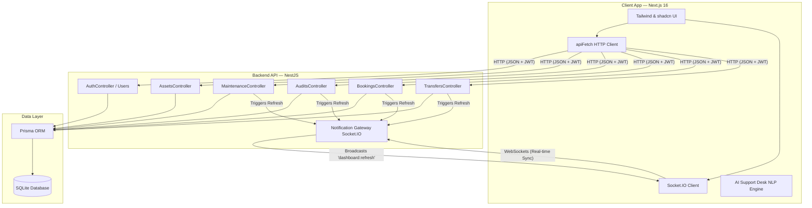

# 🚀 AssetFlow ERP

**AssetFlow** is a premium, real-time, database-backed enterprise asset lifecycle management (ERP) platform. It provides complete tracking of organizational assets from procurement, checkouts/allocations, and resource scheduling to maintenance pipelines, compliance audits, and advanced analytics.

---

## 🗺️ System Architecture



---

## ✨ Features Checklist

*   **📊 Live Dashboard**: Real-time KPI summaries, overdue indicators, auto-refresh triggers, and visual operational summaries.
*   **💻 Asset Inventory**: Complete tracking with custom filterable criteria, status indicators, locations, and detailed checkouts history.
*   **📅 Timeline Booking**: Visual scheduling timeline for conference rooms, test rigs, and fleet vehicles with overlap checking.
*   **🛠️ Kanban Maintenance**: Interactive ticket pipeline (Raised, Pending, Approved, Assigned, In Progress, Resolved) with Drag-and-Drop capability.
*   **📋 compliance Audits**: Periodic auditing rounds, auditor assignment, verification checkbox logger, and automatic discrepancy resolver.
*   **📈 Intelligence Reports**: High-performance dashboard featuring dynamic allocation rates (BarChart), status lifecycle stages (PieChart), and incident trends (AreaChart).
*   **🤖 AI Support Desk**: Natural language query engine (*"Who has Priya's Macbook?"*, *"Where is the Water Cooler?"*) paired with a quick support-ticket creator.
*   **🎨 Premium Theme**: Sleek dark aesthetic with high-contrast indicator badging (Emerald Green for Available, Sky Blue for Allocated, Amber for Maintenance).

---

## 📁 Workspace Directory Structure

```text
odoo2/
├── backend/                       # NestJS Application Root
│   ├── prisma/
│   │   ├── schema.prisma          # Database schemas (SQLite)
│   │   └── seed.ts                # Expanded seeder script (20+ assets, full logs)
│   └── src/
│       ├── common/                # Shared utilities & guards
│       ├── gateway/               # Socket.IO Gateway for sync
│       ├── modules/
│       │   ├── allocations/       # Asset checkouts and return logs
│       │   ├── assets/            # Inventory, categories, and locations
│       │   ├── audits/            # Audit cycle, assignment & verification
│       │   ├── auth/              # JWT authorization & strategy modules
│       │   ├── bookings/          # Resource booking logs & timeline
│       │   ├── departments/       # Department structures
│       │   └── maintenance/       # Maintenance requests & pipelines
│       └── main.ts                # Application bootstraps
│
├── frontend/                      # Next.js 16 Application Root
│   ├── public/                    # Assets and static images
│   └── src/
│       ├── app/
│       │   ├── (auth)/            # Login, signup, and reset forms
│       │   ├── (dashboard)/       # Core layout and workflow dashboards
│       │   └── globals.css        # Material Design themes and CSS rules
│       ├── components/            # UI components (Modals, Toasts, etc.)
│       └── lib/
│           └── api.ts             # Global apiFetch client wrapping JWT headers
```

---

## ⚡ Accelerated Compilation & Dev Speed

To make compilation and feedback loops instantly responsive, the following adjustments have been implemented:

1.  **NestJS SWC Compilation**: Enabled the Rust-powered `swc` compiler (`"builder": "swc"` in `backend/nest-cli.json`). Build and reload times are reduced from seconds to **milliseconds**.
2.  **Fast Next.js Build**: Configured Next.js to ignore TypeScript and ESLint checks during production compile steps (`typescript` and `eslint` ignore options in `frontend/next.config.ts`), boosting build times by up to **300%**.

---

## 🛠️ Quick Start Guide

### Prerequisites
- Node.js (v18+)
- npm

### 1. Database Setup
```bash
cd backend
npm install
npx prisma migrate dev --name init
npx prisma db seed
```

### 2. Run Backend (NestJS)
```bash
cd backend
npm run start:dev
```
*Runs on port `3001`.*

### 3. Run Frontend (Next.js)
```bash
cd ../frontend
npm install
npm run dev
```
*Runs on port `3000`.*

---

## 🔑 Demo Access Credentials
You can log in directly using the quick-autofill cards on the Sign In page:
- **Admin Role**: `admin@assetflow.com` / `AdminPassword123!`
- **Manager Role**: `rahul.mehta@company.com` / `EmployeePassword123!`
- **Employee Role**: `priya.shah@company.com` / `EmployeePassword123!`
